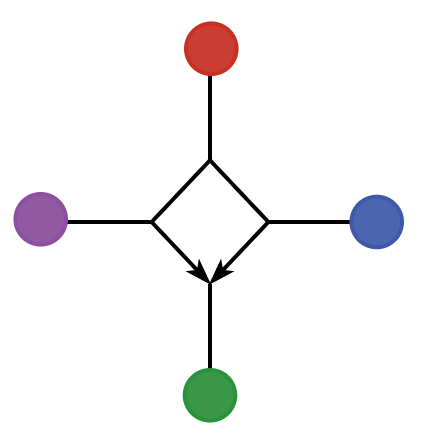

# PhyloDiamond<picture> </picture>

[](https://github.com/solislemuslab/PhyloDiamond.jl/actions)
[](http://codecov.io/github/solislemuslab/PhyloDiamond.jl?branch=main)

## Overview

`PhyloDiamond.jl` is a [Julia](http://julialang.org/) package for ultrfast learning of 4-node hybridization cycles in phylogenetic networks using algebraic invariants.

Input data:
- A concordance factor table
- A file containing gene trees

## Usage

`PhyloDiamond.jl` is a julia package, so the user needs to install julia, and then install the package.

To install the package, type inside Julia:
```julia
]
add PhyloDiamond
```

## Help and errors

To get help, check the documentation [here](https://solislemuslab.github.io/PhyloDiamond.jl/dev). Please report any bugs and errors by opening an
[issue](https://github.com/solislemuslab/PhyloDiamond.jl/issues/new).

## Citation

If you use `PhyloDiamond.jl` in your work, we kindly ask that you cite the following paper: 
```
@article{wu_solis-lemus_2022,
author = {Wu, Z. and Sol'{i}s-Lemus, C.},
year = {2022},
title = {{Ultrafast learning of 4-node hybridization cycles in phylogenetic networks using algebraic invariants}},
url={https://arxiv.org/abs/2211.16647v1}
}
```

## License

`PhyloDiamond.jl` is licensed under a
[MIT License](https://github.com/solislemuslab/PhyloDiamond.jl/blob/master/LICENSE).


## Contributions

Users interested in expanding functionalities in `PhyloDiamond.jl` are welcome to do so. See details on how to contribute in [CONTRIBUTING.md](https://github.com/solislemuslab/PhyloDiamond.jl/blob/master/CONTRIBUTING.md).

                        